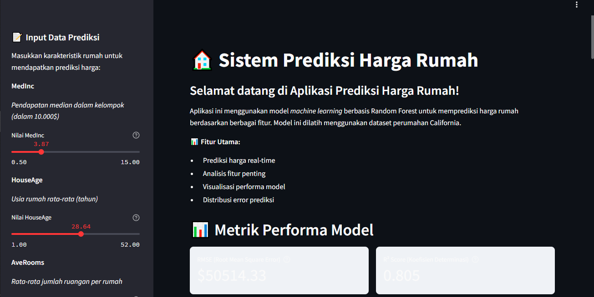
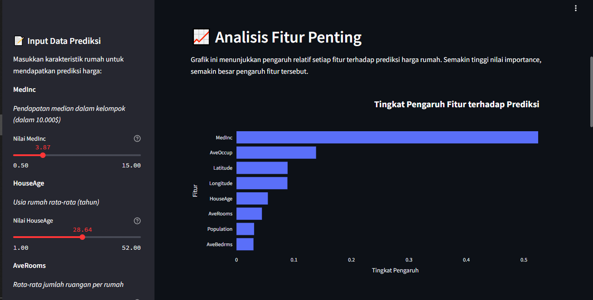
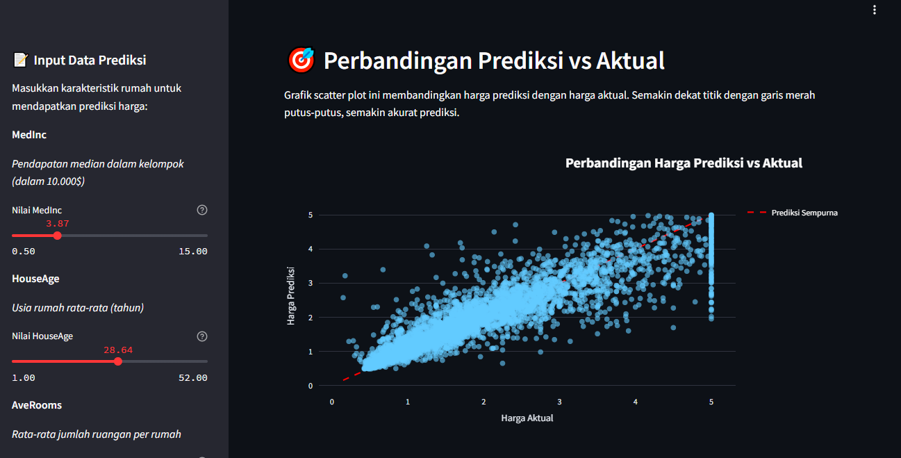
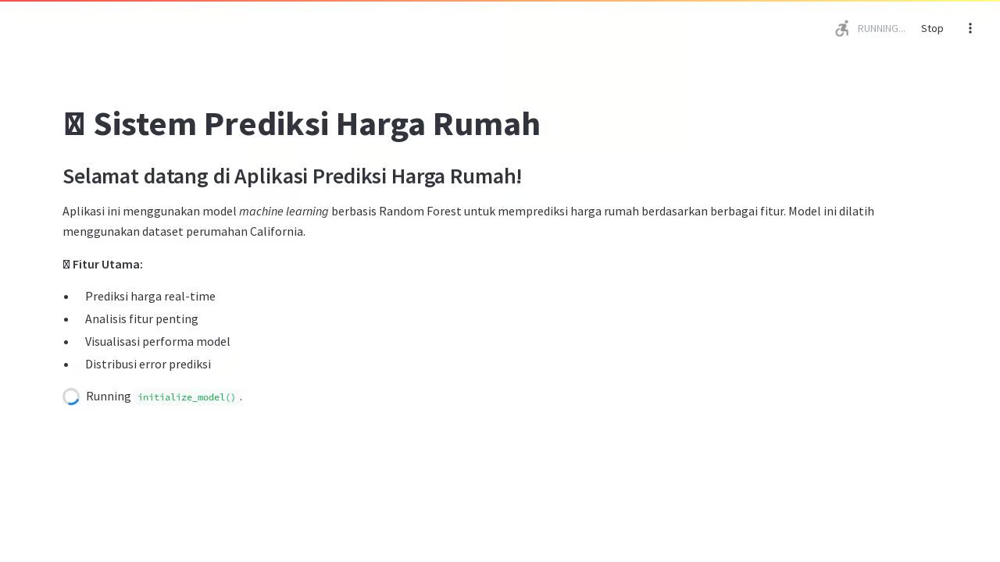

# 🏠 House Price Prediction Model | Model Prediksi Harga Rumah

A Streamlit-based machine learning application for predicting house prices using the California Housing dataset.
Aplikasi machine learning berbasis Streamlit untuk memprediksi harga rumah menggunakan dataset perumahan California.






## 🌟 Features | Fitur

- Real-time price predictions | Prediksi harga real-time
- Interactive data visualization | Visualisasi data interaktif
- Feature importance analysis | Analisis fitur penting
- Model performance metrics | Metrik performa model
- Error distribution analysis | Analisis distribusi error

## 📊 Technical Details | Detail Teknis

### Model
- Algorithm: Random Forest Regressor
- Features:
  - MedInc: Median income in block group | Pendapatan median dalam kelompok
  - HouseAge: Median house age | Usia rumah rata-rata
  - AveRooms: Average number of rooms | Rata-rata jumlah ruangan
  - AveBedrms: Average number of bedrooms | Rata-rata jumlah kamar tidur
  - Population: Block group population | Populasi area
  - AveOccup: Average occupancy | Rata-rata jumlah penghuni
  - Latitude: Block group latitude | Garis lintang lokasi
  - Longitude: Block group longitude | Garis bujur lokasi

### Technologies Used | Teknologi yang Digunakan
- Python 3.11
- Streamlit
- scikit-learn
- pandas
- numpy
- plotly

## 🚀 Getting Started | Memulai

### Prerequisites | Prasyarat
- Python 3.11 or higher
- pip package manager

### Installation | Instalasi

1. Clone the repository | Clone repositori
```bash
git clone <repository-url>
```

2. Install dependencies | Install dependensi
```bash
pip install -r requirements.txt
```

3. Run the application | Jalankan aplikasi
```bash
streamlit run app.py
```

## 📱 Usage | Penggunaan

1. Input house characteristics using the sliders in the sidebar
   Masukkan karakteristik rumah menggunakan slider di sidebar

2. Click "Prediksi Harga" to get the predicted price
   Klik "Prediksi Harga" untuk mendapatkan prediksi harga

3. Explore various visualizations:
   Jelajahi berbagai visualisasi:
   - Feature importance chart | Grafik pengaruh fitur
   - Predictions vs actual values | Perbandingan prediksi vs aktual
   - Error distribution | Distribusi error

## 📈 Performance Metrics | Metrik Performa

The model's performance is evaluated using:
Performa model dievaluasi menggunakan:

- RMSE (Root Mean Square Error)
- R² Score (Coefficient of Determination | Koefisien Determinasi)

## 🔗 References | Referensi

- California Housing Dataset: [Scikit-learn Datasets](https://scikit-learn.org/stable/datasets/real_world.html#california-housing-dataset)
- Random Forest Algorithm: [Scikit-learn Documentation](https://scikit-learn.org/stable/modules/generated/sklearn.ensemble.RandomForestRegressor.html)

## 📝 License | Lisensi

This project is licensed under the MIT License - see the LICENSE file for details.
Proyek ini dilisensikan di bawah Lisensi MIT - lihat file LICENSE untuk detail.
